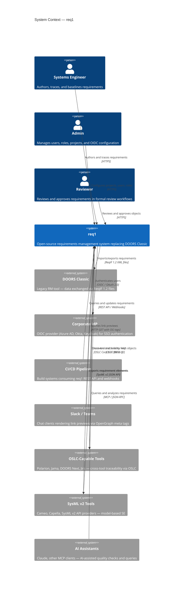

# 3. Context and Scope

## 3.1 System Context Diagram

## 3.2 Business Context

| Partner | Input | Output | Protocol |
|---------|-------|--------|----------|
| Systems Engineer | Requirement edits, link definitions, baseline requests | Updated objects, traceability reports, baseline diffs | HTTPS (SPA) |
| Admin | User/role/project configuration | Confirmation, audit entries | HTTPS (SPA) |
| Reviewer | Review decisions (approve/reject/comment) | Review status, notifications | HTTPS (SPA) |
| DOORS Classic | ReqIF 1.2 export files | ReqIF 1.2 import files | File exchange |
| Corporate IdP | OIDC discovery, token exchange | ID token, user claims | OIDC / OAuth 2.0 |
| CI/CD Pipeline | REST API calls, webhook subscriptions | JSON responses, webhook events | HTTPS |
| Slack / Teams | HTTP GET for shared links | HTML with OpenGraph meta tags | HTTPS |
| OSLC-Capable Tools | OSLC resource discovery, selection dialogs, link creation | OSLC RM resources (JSON-LD/RDF), service provider catalog | OSLC Core 3.0 / HTTPS |
| SysML v2 Tools | SysML v2 requirement elements (JSON) | SysML v2 requirement elements (JSON) | SysML v2 REST API / HTTPS |
| AI Assistants | MCP tool calls (search, analyze, quality check) | Structured results (objects, coverage, quality reports) | MCP / JSON-RPC / HTTPS |

## 3.3 Technical Context

| Channel | Protocol | Format | Notes |
|---------|----------|--------|-------|
| Browser → nginx → Axum | HTTPS | JSON (REST API), HTML/JS/CSS (SPA) | TLS terminated at nginx |
| Axum → PostgreSQL | TCP | SQL (sea-orm / sqlx) | Connection pool via deadpool/sqlx |
| Axum → Redis | TCP | RESP | Sessions, cache, rate limiting |
| Axum → SeaweedFS | HTTP | S3-compatible API | File attachments, images |
| Axum → Corporate IdP | HTTPS | OIDC (JSON) | Token exchange, user info |
| Axum → Webhook targets | HTTPS | JSON | Event notifications to CI/CD |
| CLI → Axum | HTTPS | JSON (REST API) | Headless automation |
| Axum → OSLC Tools | HTTPS | JSON-LD (OSLC Core 3.0) | Cross-tool link creation (client role) |
| OSLC Tools → Axum | HTTPS | JSON-LD (OSLC RM 2.1) | Resource discovery and selection (server role) |
| Axum ↔ SysML v2 Tools | HTTPS | JSON (SysML v2 API) | Requirement element import/export |
| MCP Client → Axum | HTTPS | JSON-RPC (MCP) | AI assistant tool invocation |
