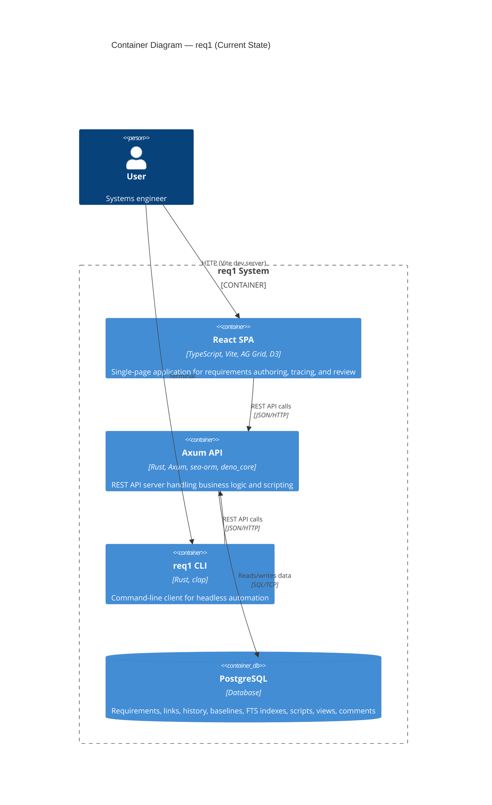
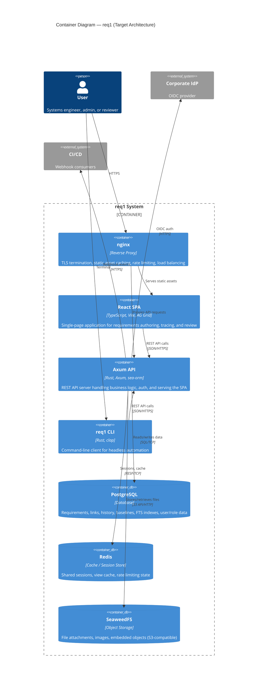

# 5. Building Block View

## 5.1 Level 1 — Container Diagram (Current)



### Level 1 — Container Diagram (Target)



## 5.2 Level 2 — Rust Workspace (Implemented)

The backend is organized as a Cargo workspace with 6 members:

```
req1/
├── crates/
│   ├── req1-server/     Axum web server — routes, config, state, error handling
│   ├── req1-core/       Business logic — services, validation, scripting, fingerprinting
│   ├── req1-cli/        CLI client — clap-based, talks to server REST API
│   └── req1-reqif/      ReqIF crate (stub, planned)
├── entity/              Sea-ORM entities — 21 database models
└── migration/           Sea-ORM migrations — 23 sequential migrations
```

### req1-server Route Modules (22 files)

| Route module | Endpoints |
|-------------|-----------|
| `health.rs` | `GET /health/ready` |
| `workspaces.rs` | Workspace CRUD |
| `projects.rs` | Project CRUD |
| `modules.rs` | Module CRUD + templates (`POST /modules/from-template`) |
| `objects.rs` | Object CRUD, history, filters, FTS, soft delete |
| `links.rs` | Link CRUD, suspect detection |
| `baselines.rs` | Baseline CRUD, snapshot diff |
| `baseline_sets.rs` | Baseline set CRUD |
| `attribute_definitions.rs` | Attribute definition CRUD + validation |
| `object_types.rs` | Object type CRUD + schema enforcement |
| `traceability.rs` | Traceability matrix, coverage metrics |
| `impact.rs` | BFS impact analysis (forward/backward/both) |
| `scripts.rs` | Script CRUD, test, execute, batch layout |
| `validation.rs` | Module validation (built-in + JavaScript rules) |
| `publish.rs` | HTML publishing (minijinja templates) |
| `views.rs` | Saved view CRUD |
| `comments.rs` | Comment CRUD + resolve/unresolve |
| `app_users.rs` | User account CRUD |
| `review_packages.rs` | Review package CRUD |
| `review_assignments.rs` | Review assignment CRUD |
| `change_proposals.rs` | Change proposal CRUD |

### req1-core Service Layer

| Service | Responsibility |
|---------|---------------|
| `service/object.rs` | Object CRUD, history recording, fingerprinting, FTS, soft delete |
| `service/module.rs` | Module CRUD, template cloning |
| `service/link.rs` | Link CRUD, suspect flag detection |
| `service/baseline.rs` | Baseline creation, word-level diffing |
| `service/validation_service.rs` | Built-in rules + JavaScript custom validation |
| `service/publish.rs` | HTML template rendering |
| `service/view.rs` | Saved view config |
| `service/comment.rs` | Comment thread management |
| `service/object_type.rs` | Type constraints + schema validation |
| `service/app_user.rs` | User management |
| `service/review_package.rs` | Review package lifecycle |
| `service/review_assignment.rs` | Review assignment lifecycle |
| `service/change_proposal.rs` | Change proposal lifecycle |
| `service/baseline_set.rs` | Baseline set management |
| `service/workspace.rs` | Workspace CRUD |
| `service/project.rs` | Project CRUD |
| `scripting/engine.rs` | JavaScript (V8) runtime — sandboxed, triggers/layout/actions |

## 5.3 Level 2 — Axum API Components (Target Architecture)

> This diagram shows the full target architecture including planned components.
> Components marked with `[impl]` are implemented; others are planned.

```mermaid
C4Component
    title Component Diagram — Axum API (Target)

    Container_Boundary(api, "Axum API") {
        Component(auth, "Auth Module", "openidconnect, argon2, jsonwebtoken", "OIDC login, local auth, JWT issuance, session management [planned]")
        Component(crud, "CRUD Module", "sea-orm, sqlx", "Object/module/attribute CRUD with history tracking [impl]")
        Component(baseline, "Baseline Module", "sqlx", "Baseline creation, locking, and structured diff queries [impl]")
        Component(trace, "Traceability Module", "sqlx", "Link CRUD, suspect detection, coverage analysis, graph traversal [impl]")
        Component(reqif, "ReqIF Module", "quick-xml, serde", "ReqIF 1.2 import/export with attribute mapping [planned]")
        Component(export, "Export Module", "minijinja, pulldown-cmark", "HTML publishing from templates [impl]; PDF/DOCX [planned]")
        Component(search, "Search Module", "sqlx (PG FTS)", "Full-text search with tsvector/tsquery and GIN indexes [impl]")
        Component(audit, "Audit Module", "sea-orm", "Writes every mutation to history tables with attribute-level granularity [impl]")
        Component(webhooks, "Webhook Module", "reqwest", "Event dispatch to registered webhook endpoints [planned]")
        Component(oslc, "OSLC Module", "JSON-LD, serde", "OSLC Core 3.0 provider + consumer [planned]")
        Component(sysml, "SysML v2 Module", "serde_json", "Import/export SysML v2 requirement elements [planned]")
        Component(scripting, "Script Engine", "deno_core", "Embedded JavaScript (V8) runtime. Triggers, layout scripts, actions. [impl]")
        Component(mcp, "MCP Server", "JSON-RPC", "Model Context Protocol provider [planned]")
        Component(risk, "Risk Module", "sea-orm, sqlx", "Hazard register, risk matrices, FMEA views [planned]")
        Component(roundtrip, "Roundtrip Module", "serde_json, sha2", "Delta-aware export/reimport with content hashing [planned]")
    }

    ContainerDb(pg, "PostgreSQL", "Database")
    ContainerDb(redis, "Redis", "Cache [planned]")
    ContainerDb(seaweedfs, "SeaweedFS", "Object Storage [planned]")
    System_Ext(idp, "Corporate IdP", "OIDC [planned]")

    Rel(crud, pg, "Object/attribute CRUD + history", "SQL")
    Rel(baseline, pg, "Baseline snapshots + diffs", "SQL")
    Rel(trace, pg, "Link CRUD + suspect flags", "SQL")
    Rel(export, pg, "Read objects for rendering", "SQL")
    Rel(search, pg, "FTS queries", "SQL")
    Rel(audit, pg, "History table writes", "SQL")
    Rel(scripting, pg, "Script-initiated reads/writes", "SQL")
```



## 5.4 Level 2 — React SPA Components (Implemented)

| Component | Library | Purpose |
|-----------|---------|---------|
| `App.tsx` | React Router v7 | Root layout — header, sidebar, breadcrumbs, nested route outlet |
| `Sidebar.tsx` | React | Workspace/project/module navigation tree, CRUD, template selector |
| `ModuleDetail.tsx` | AG Grid v33 | Primary editing interface — virtual-scrolling grid with inline editing, object CRUD, tab switching |
| `ObjectTree.tsx` | React | Hierarchical outline panel (240px, collapsible, click-to-scroll) |
| `BaselinePanel.tsx` | React | Baseline CRUD, snapshot comparison dropdowns |
| `DiffView.tsx` | React | Word-level inline diff for baseline comparison |
| `ImpactPanel.tsx` | React | Impact analysis modal — depth-grouped results, graph toggle |
| `ImpactGraph.tsx` | D3 (force-directed) | SVG graph visualization of link chains |
| `CoverageWidget.tsx` | React | Coverage bars (upstream/downstream %) |
| `CommentPanel.tsx` | React | Comment thread per object — add, resolve, delete |
| `ScriptPanel.tsx` | React | JavaScript script CRUD — trigger/layout/action types |
| `ValidationPanel.tsx` | React | Validation report display (issues list) |
| `ObjectTypePanel.tsx` | React | Object type CRUD — schemas, required attributes |
| `ModuleSettings.tsx` | React | Module config: prefix, separator, digits, classification |
| `ViewBar.tsx` | React | Saved view selector — save/load/delete/apply column config |
| `ObjectHistory.tsx` | React | Change history modal per object |
| `api/client.ts` | fetch | REST API client — typed request/response helpers |
| `diff.ts` | — | Word-level diff utility |
| `theme.ts` | — | Centralized styling constants |

### Pages (React Router)

| Page | Route | Purpose |
|------|-------|---------|
| `WelcomePage.tsx` | `/` | Landing page |
| `WorkspacePage.tsx` | `/workspaces/:id` | Workspace detail |
| `ProjectPage.tsx` | `/projects/:id` | Project detail |
| `ModulePage.tsx` | `/modules/:id` | Module detail (tabs: Objects, Links, Baselines, Attributes, Scripts, Validation, Types, Settings) |
| `TraceabilityPage.tsx` | `/traceability/:id` | Cross-module traceability matrix |

### Planned SPA Components (not yet implemented)

| Component | Library | Purpose |
|-----------|---------|---------|
| Tree Outline | react-arborist + dnd-kit | Drag-and-drop reordering with numbered headings |
| Rich Text Editor | TipTap | ProseMirror-based editor for requirement body |
| Review UI | React | Formal review workflow — participant assignment, per-object voting |
| Admin Panel | React | User/role management, OIDC provider configuration |

## 5.5 Key Data Model (Implemented)

21 entities across 23 migrations:

```
┌─────────────────────────────────────────────────────────────────┐
│ PostgreSQL Schema (implemented — 21 tables)                     │
├─────────────────────────────────────────────────────────────────┤
│                                                                 │
│  workspace ──< project ──< module ──< object                   │
│                                │         │                      │
│                                │         ├── object_history     │
│                                │         │   (version, JSONB    │
│                                │         │    attributes,       │
│                                │         │    changed_by/at,    │
│                                │         │    change_type)      │
│                                │         │                      │
│                                │         ├── object_type (FK)   │
│                                │         │   (required_attrs,   │
│                                │         │    attribute_schema, │
│                                │         │    default_classif.) │
│                                │         │                      │
│                                │         ├── comment            │
│                                │         │   (body, resolved,   │
│                                │         │    author)           │
│                                │         │                      │
│                                │         ├── deleted_at         │
│                                │         │   (soft delete)      │
│                                │         │                      │
│                                │         └──< link ──> object   │
│                                │              │                 │
│                                │              ├── link_type (FK)│
│                                │              ├── suspect_flag  │
│                                │              └── attributes    │
│                                │                                │
│                                ├── attribute_definition         │
│                                │   (name, data_type,            │
│                                │    multi_select, enum_values)  │
│                                │                                │
│                                ├── script                       │
│                                │   (type: trigger/layout/action,│
│                                │    hook_point, source_code)    │
│                                │                                │
│                                ├── view                         │
│                                │   (column_config, filter_config│
│                                │    sort_config)                │
│                                │                                │
│                                └── module config fields         │
│                                    (prefix, separator, digits,  │
│                                     required_attributes,        │
│                                     default_classification)     │
│                                                                 │
│  baseline ──< baseline_entry                                    │
│     │          (object_id, version)  ── points to ──>           │
│     │                                   object_history          │
│     └── baseline_set (FK)                                       │
│          (name, version)                                        │
│                                                                 │
│  app_user (email, display_name, role, active)                   │
│                                                                 │
│  review_package ──< review_assignment                           │
│    (name, status)      (user, status)                           │
│                                                                 │
│  change_proposal (title, status, diff_data JSONB)               │
│                                                                 │
│  attachment (file_name, content_type, size_bytes,               │
│              storage_path, sha256)                              │
│                                                                 │
│  link_type (name, description)                                  │
└─────────────────────────────────────────────────────────────────┘
```
