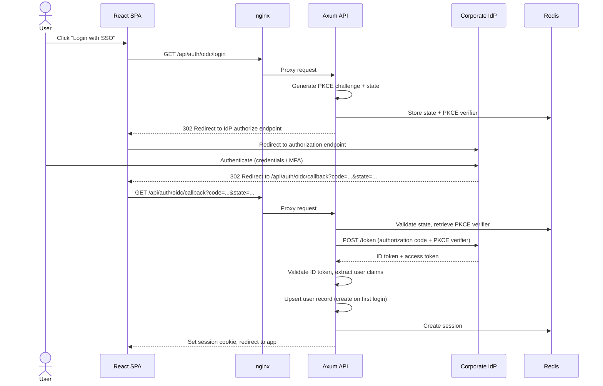
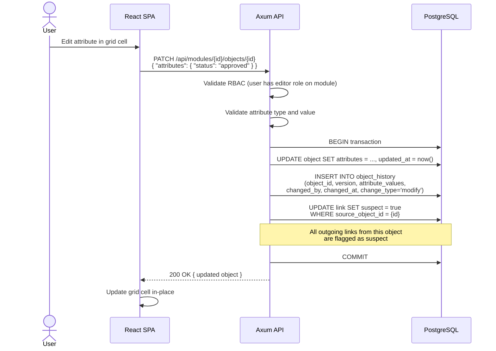
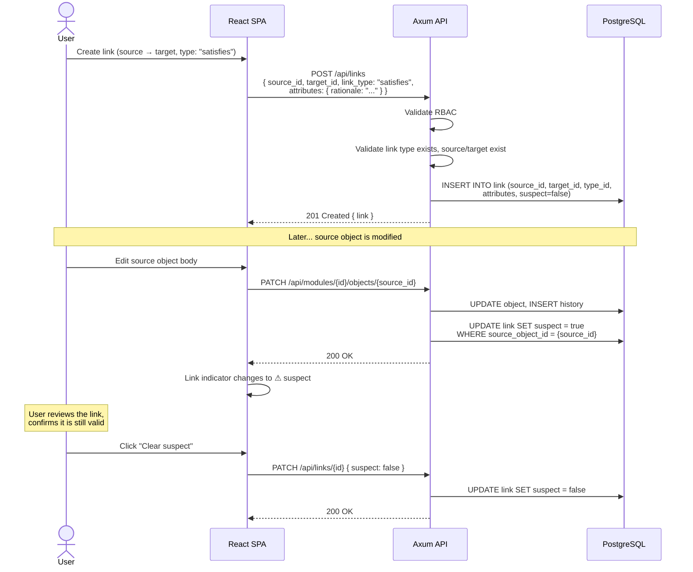
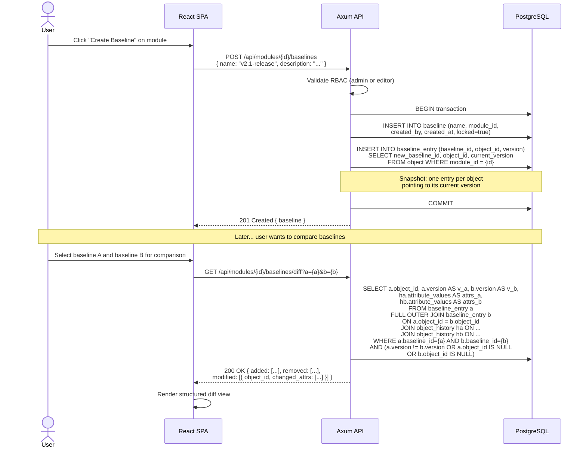
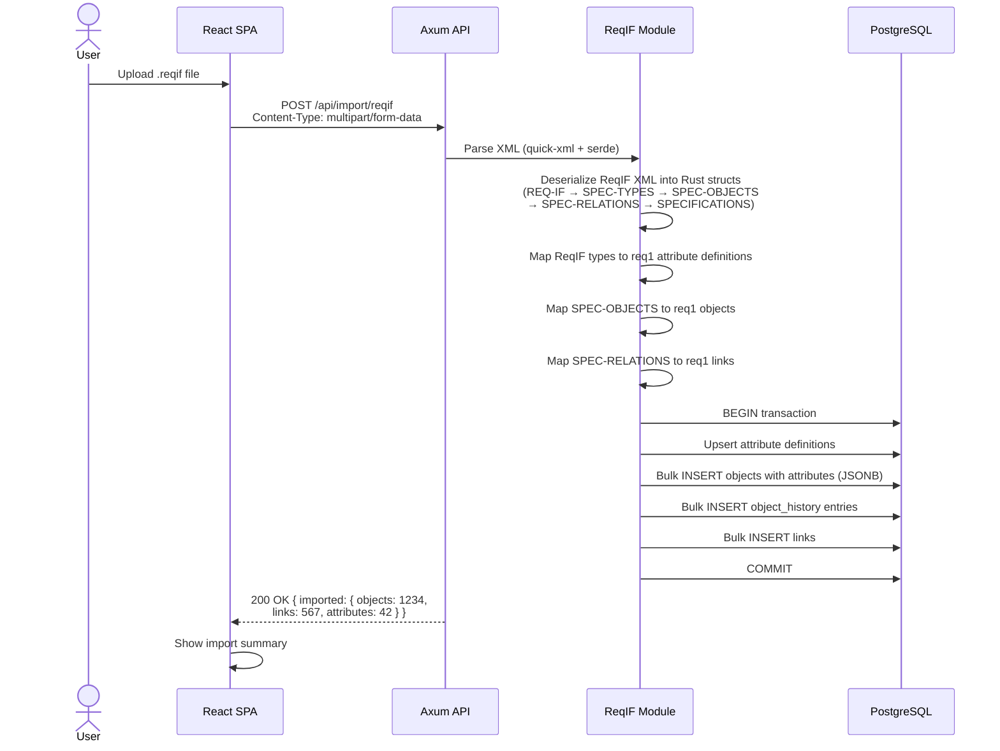
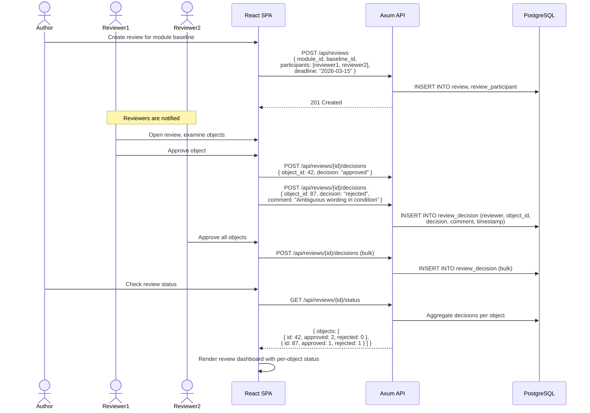
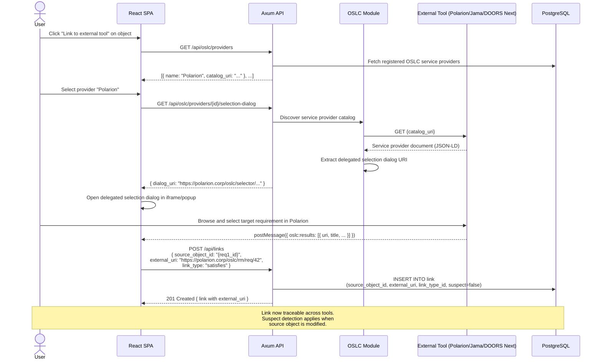
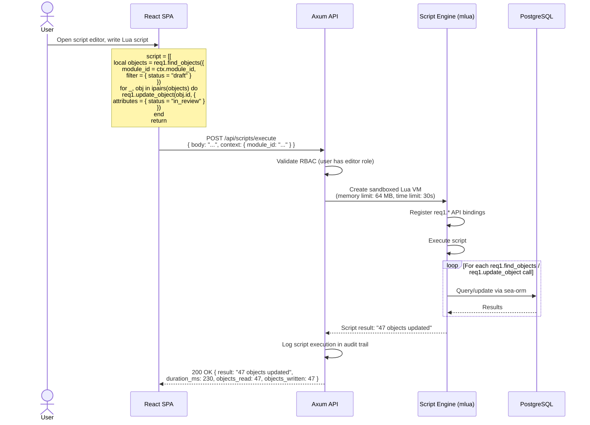
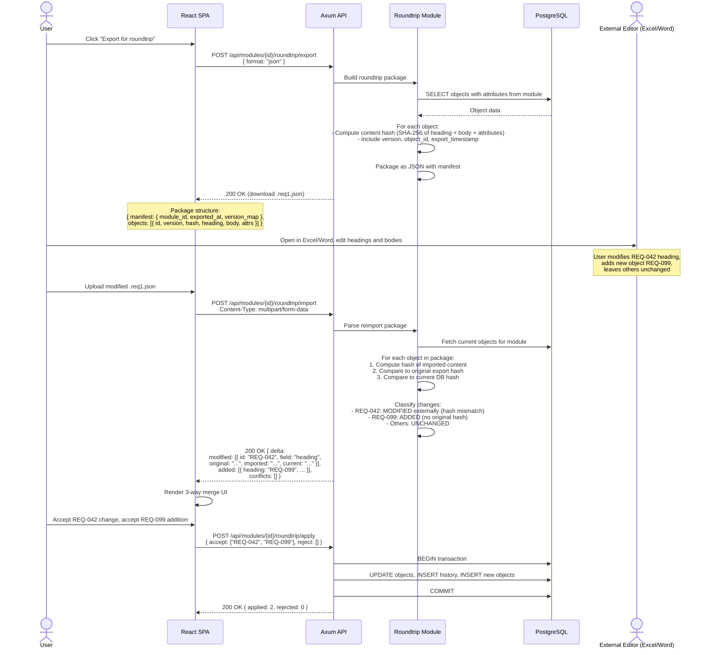
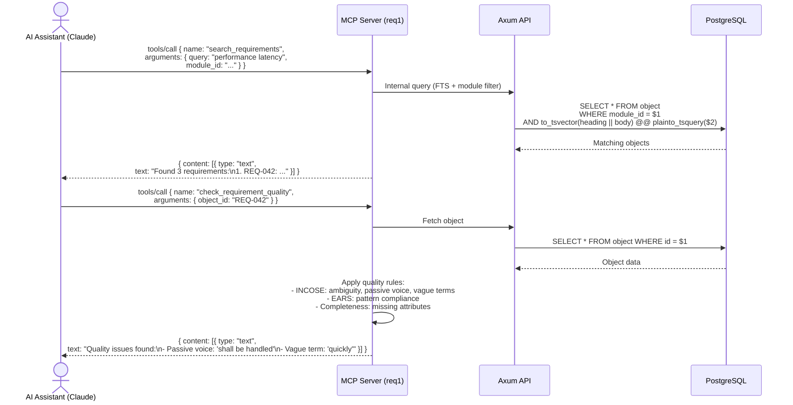

# 6. Runtime View

## 6.1 OIDC Login Flow

## 6.2 Create / Edit Requirement

## 6.3 Create Link + Suspect Detection

## 6.4 Create Baseline + Diff

## 6.5 ReqIF Import

## 6.6 Formal Review Workflow

## 6.7 OSLC Cross-Tool Link Creation

## 6.8 Lua Script Execution

## 6.9 Roundtrip Export → External Edit → Reimport

## 6.10 MCP Tool Invocation

