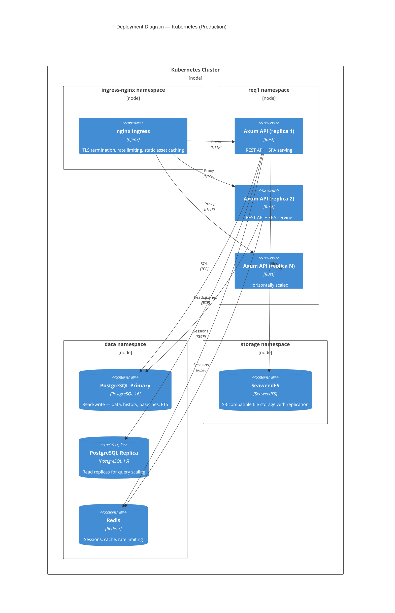

# 7. Deployment View

## 7.1 Kubernetes Deployment (Production)



### Kubernetes Resource Summary

| Resource | Kind | Replicas | Notes |
|----------|------|----------|-------|
| nginx ingress | Ingress + IngressController | 2+ | TLS cert via cert-manager |
| Axum API | Deployment | 2+ (HPA) | Stateless, liveness + readiness probes |
| PostgreSQL Primary | StatefulSet | 1 | Persistent volume, WAL archiving |
| PostgreSQL Replica | StatefulSet | 1+ | Streaming replication, read-only |
| Redis | Deployment or StatefulSet | 1 | Persistent if needed for session durability |
| SeaweedFS | StatefulSet | 3+ | Master + volume servers, erasure coding |

### Infrastructure Configuration

| Aspect | Configuration |
|--------|--------------|
| TLS | cert-manager with Let's Encrypt or corporate CA |
| Secrets | Kubernetes Secrets or external vault (HashiCorp Vault) |
| Config | ConfigMaps + environment variables (12-factor) |
| Monitoring | Prometheus (scrape /metrics), Grafana dashboards |
| Tracing | OpenTelemetry Collector → Jaeger or Tempo |
| Logging | Structured JSON logs → Loki or ELK |
| Backups | pg_basebackup + WAL archiving to S3-compatible storage |

## 7.2 Docker Compose (Small Team / Production)

Production deployment uses `docker-compose.prod.yml` with a multi-stage `Dockerfile`:

### Multi-Stage Dockerfile

Three stages:
1. **Frontend** (`oven/bun:1`) — `bun install --frozen-lockfile` + `bun run build` produces `dist/`
2. **Backend** (`rust:1-bookworm`) — dependency caching via dummy source files, then `cargo build --release --bin req1-server`
3. **Runtime** (`debian:bookworm-slim`) — `ca-certificates`, `libssl3`, `curl` (healthcheck). Non-root user (uid 1000). Static assets served by the Axum binary via `tower-http::ServeDir` with SPA fallback.

Debian-slim (not Alpine) because deno_core/V8 requires glibc.

### docker-compose.prod.yml

```bash
# Start full stack
docker compose -f docker-compose.prod.yml up -d

# With custom credentials
POSTGRES_PASSWORD=mysecret CORS_ORIGIN=https://app.example.com \
  docker compose -f docker-compose.prod.yml up -d
```

Services:
- **app** — builds from `Dockerfile`, exposes port 8080, healthcheck via `/health/live`
- **postgres:16-alpine** — persistent volume, healthcheck via `pg_isready`
- **redis:7-alpine** — persistent volume, healthcheck via `redis-cli ping`
- All services use `depends_on` with `condition: service_healthy` and `restart: unless-stopped`
- Postgres and Redis ports are not exposed externally (internal network only)

### Server Features

- **Graceful shutdown** — handles SIGTERM and Ctrl+C for clean container stops
- **Configurable CORS** — `CORS_ORIGIN` env var: unset or `*` = permissive; comma-separated origins for restrictive mode
- **Static file serving** — `STATIC_DIR` env var points to frontend `dist/`, serves with SPA fallback (`index.html`)
- **Cache-Control** — `/assets/*` gets `immutable` (Vite hashed filenames), HTML gets `no-cache`
- **Build SHA** — `BUILD_SHA` env var included in health endpoint responses

### Single-Node Deployment Notes

- All services on one host — suitable for teams of 5–20 users
- nginx optional (Axum serves TLS directly or sits behind a host-level reverse proxy)
- Backup strategy: `pg_dump` cron job + volume snapshots
- Upgrade path: `docker compose -f docker-compose.prod.yml build && docker compose -f docker-compose.prod.yml up -d`

## 7.3 Devcontainer (Developer Onboarding)

For developers who cannot or prefer not to install dependencies natively, a devcontainer configuration is provided. The `docker-compose.yml` includes a `dev` service behind the `dev` profile using an Ubuntu 24.04 base image with all tooling installed directly (no Nix). A Nix flake is also available for native development.

- **Image:** Ubuntu 24.04 + Rust (rustup) + Bun + go-task + Docker CLI + docker-compose
- **Network:** `network_mode: host` — `.env` localhost URLs work unchanged, no port mapping needed
- **PID namespace:** `pid: host` — `task _kill` can manage stale processes across namespaces
- **Port forwarding:** Disabled (`remote.autoForwardPorts: false`) — redundant with host networking and causes port conflicts if enabled
- **Socket:** Host Docker socket mounted into the dev container (`/var/run/docker.sock`)
- **Compose project name:** Fixed to `req1` (via top-level `name:` in `docker-compose.yml`) so container/host invocations always see the same containers
- **Workflow:** Open devcontainer → `task dev` (or natively: `nix develop` → `task dev`)

## 7.4 Deployment Topology Comparison

| Aspect | Docker Compose | Kubernetes |
|--------|----------------------|------------|
| Users | 5–20 | 20–1000+ |
| Scaling | Vertical only | Horizontal (HPA) |
| HA | No | Yes (multi-replica, PG failover) |
| Complexity | Low | Medium–High |
| Backup | pg_dump + cron | WAL archiving + PV snapshots |
| Monitoring | Container logs | Prometheus + Grafana + OTel |
| TLS | Host reverse proxy or Axum | cert-manager + nginx ingress |
